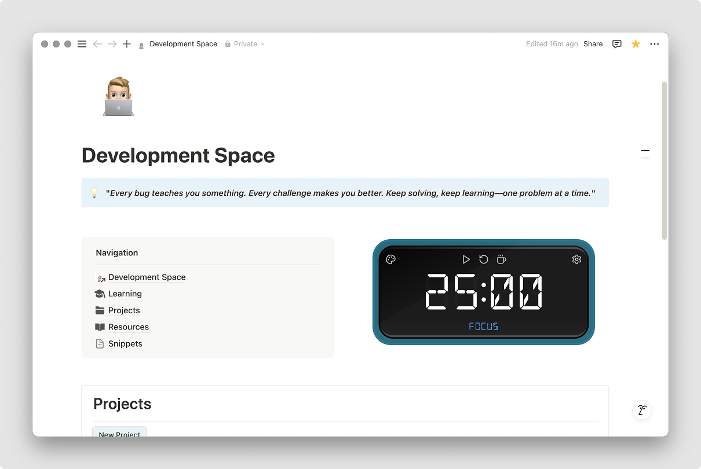

# Pomodoro Widget

A simple, customisable digital clock-style Pomodoro timer designed for Notion embeds, the web and macOS.

## Features

- Minimal, distraction-free Pomodoro timer
- Customisable focus and break durations
- Vintage 60s-inspired colour palette
- Sound effects for session transitions and controls
- Keyboard shortcuts for fast control
- Responsive and embeddable widget
- Saves your preferences with localStorage

## Getting Started

### Installation

```bash
git clone https://github.com/markslorach/notion-pomodoro.git
cd notion-pomodoro
pnpm install
```

### Development (Web)

To start the web app in development mode:

```bash
pnpm dev
```

To build the web app for production:

```bash
pnpm build
```

To preview the production build locally:

```bash
pnpm preview
```

### Development (macOS)

Developing and building the Pomodoro app as a native macOS application requires [Tauri](https://tauri.app/), which wraps the web app in a lightweight desktop shell.

#### Prerequisites
- [Rust](https://www.rust-lang.org/tools/install)
  - Install with -
    ```bash
    curl --proto '=https' --tlsv1.2 -sSf https://sh.rustup.rs | sh
    ```
- Xcode Command Line Tools

#### Development

To run the macOS app in development mode -

```bash
pnpm tauri dev
```

#### Build

To create a production build of the macOS app -

```bash
pnpm tauri build
```

This will generate a `.app` bundle in the `src-tauri/target/release/bundle/macos/` directory.

After building, a window will appear allowing you to install the app directly into your Applications folder.

## Usage

- Adjust focus and break times in the settings.
- Choose your preferred timer colour in the colour palette.
- Use keyboard shortcuts for quick control.

## Embedding in Notion

You can embed the Pomodoro timer directly into your Notion pages using the public instance -

**Embed URL:** [https://pomodoro.markslorach.com/](https://pomodoro.markslorach.com/)

1. In Notion, type "/embed" and select the "Embed" block.
2. Paste the URL above into the embed block.
3. Resize the embed block as needed for the best fit.

## Keyboard Shortcuts

<table>
  <thead>
    <tr>
      <th>Shortcut</th>
      <th>Action</th>
    </tr>
  </thead>
  <tbody>
    <tr>
      <td><kbd>Space</kbd></td>
      <td>Play/Pause timer</td>
    </tr>
    <tr>
      <td><kbd>R</kbd></td>
      <td>Reset timer</td>
    </tr>
    <tr>
      <td><kbd>F</kbd></td>
      <td>Reset timer</td>
    </tr>
    <tr>
      <td><kbd>B</kbd></td>
      <td>Switch to break mode</td>
    </tr>
    <tr>
      <td><kbd>S</kbd></td>
      <td>Toggle settings panel</td>
    </tr>
    <tr>
      <td><kbd>C</kbd></td>
      <td>Toggle colour palette</td>
    </tr>
    <tr>
      <td><kbd>Esc</kbd></td>
      <td>Close settings/colour palette</td>
    </tr>
  </tbody>
</table>

## Tech Stack

- React 19
- TypeScript
- Tailwind CSS
- shadcn/ui
- Vite
- Tauri


## Acknowledgements

- [@joshwcomeau/use-sound](https://github.com/joshwcomeau/use-sound)
- [@bradgarropy/use-countdown](https://github.com/bradgarropy/use-countdown)
- [@juliencrn/usehooks-ts](https://github.com/juliencrn/usehooks-ts.git)

<br/>

